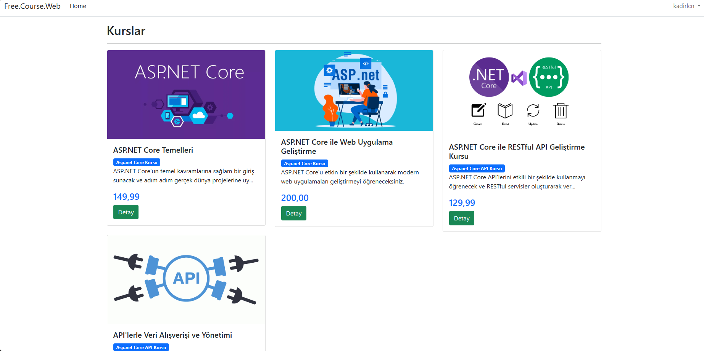
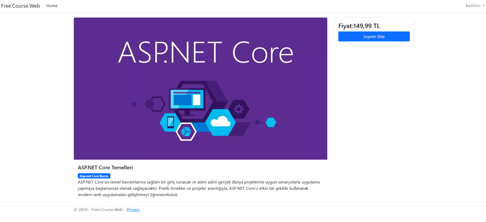
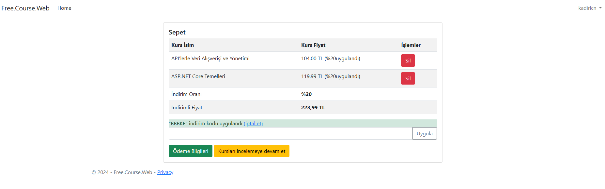
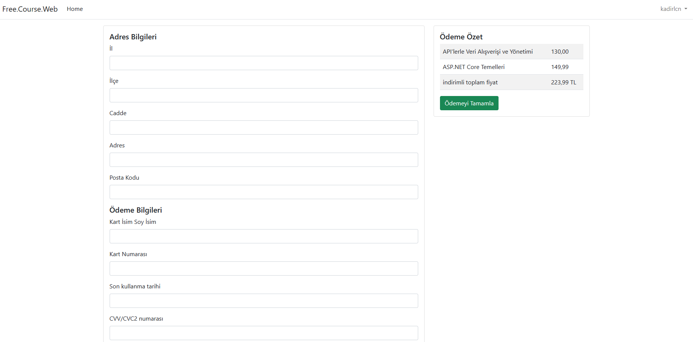
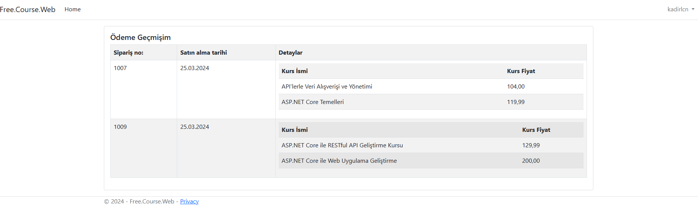
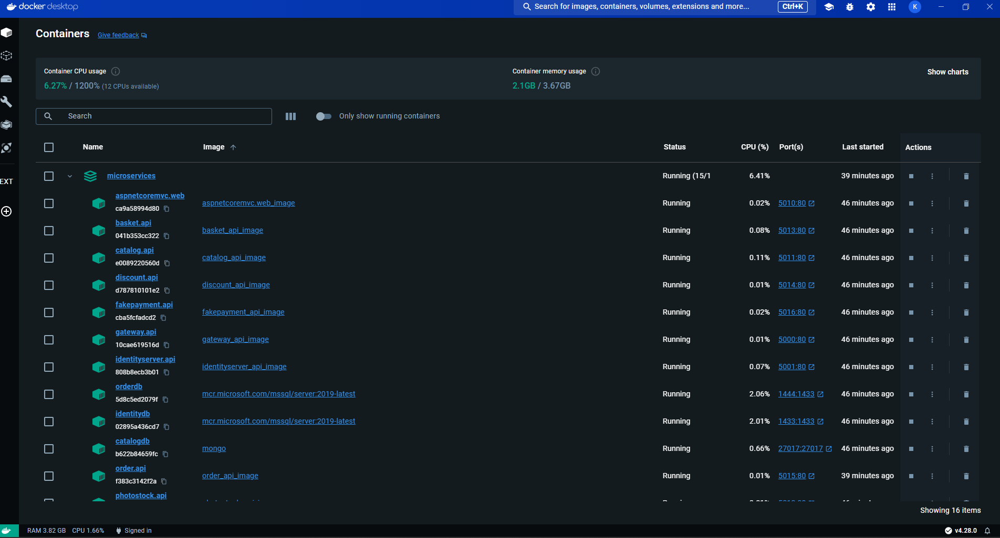
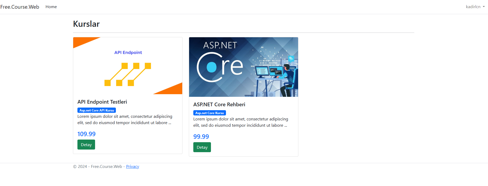

## In The Project,

>### Microservices :

>>Catalog Microservice

>Microservice MongoDb (Database) which will be responsible for the storage and presentation of information about the courses

>>Basket Microservice

>Microservice RedisDB (Database) responsible for cart operations

>>Discount Microservice

>Microservice PostgreSQL (Database) that will be responsible for the discount coupons to be defined to the user

>>Order Microservice

>Microservice responsible for order processing

>In this microservice we used the MediatR library to implement the CQRS design pattern, along with the Domain Driven Design approach.

>>FakePayment Microservice

>Microservice responsible for payment processing

>>IdentityServer Microservice

>Microservice (Sql Server Database) responsible for user data storage, token and refreshtoken generation

>>PhotoStock Microservice

>The microservice responsible for maintaining and serving course photos.

>>Asp.Net Core MVC Microservice

>UI microservice that will display the data received from microservices to the user and will be responsible for interacting with the user
---

>Home page and detail page of the course sales platform

----

>Adding courses to the basket, using the discount code and making orders

----

>check buying history

---

>Standing up the project with Docker Compose
